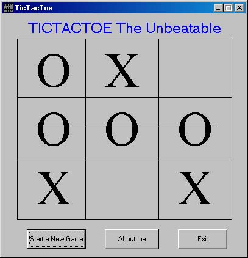



## ^TicTacToe Game^

### Description

This is Updated version of TicTacToe game where the computer plays against you, it is really UNBEATABLE. Its a simple game though. The game now has more chances of winning. The previous version could be defeated. The code is well commented. Please give me your comments and rating.
 
### More Info
 

             |
---                |---
**Submitted On**   |2002-08-03 00:11:04
**By**             |[Niloy Mondal](https://github.com/Planet-Source-Code/PSCIndex/blob/master/ByAuthor/niloy-mondal.md)
**Level**          |Beginner
**User Rating**    |5.0 (25 globes from 5 users)
**Compatibility**  |VB 5\.0, VB 6\.0
**Category**       |[Games](https://github.com/Planet-Source-Code/PSCIndex/blob/master/ByCategory/games__1-38.md)
**World**          |[Visual Basic](https://github.com/Planet-Source-Code/PSCIndex/blob/master/ByWorld/visual-basic.md)
**Archive File**   |[^TicTacToe113687822002\.zip](https://github.com/Planet-Source-Code/niloy-mondal-tictactoe-game__1-37476/archive/master.zip)

